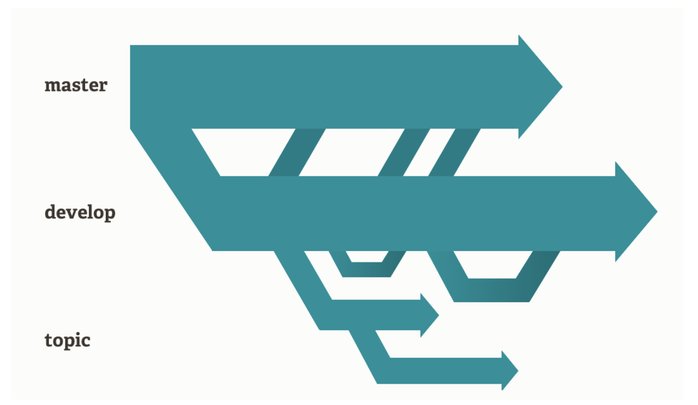
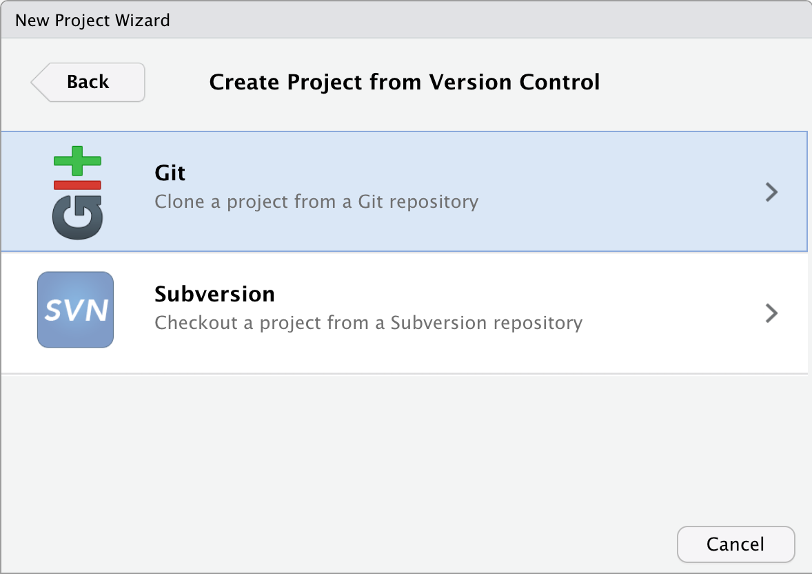

**Material disponible en:**

- https://github.com/RLadiesCuerna/meetup_agosto_2023

**Diapositivas disponibles en:**

- https://rladiescuerna.github.io/meetup_agosto_2023/slides.html
- https://rladiescuerna.github.io/meetup_agosto_2023/slides.pdf

Material basado en [Happy Git with R](https://happygitwithr.com) de Jenny Bryan, the STAT 545 TAs, Jim Hester.


---
# ¿Qué es Git?

- Git es un software libre que funciona como un sistema de control de versiones.

- Permite guardar y compartir código.

- Permite regresar a versiones anteriores, revisar cambios y crear ramas experimentales para probar código sin dañar el código principal.

```{r, echo=FALSE, out.width='35%', fig.align='center'}

```

---
# Instalación

Git se puede utilizar en todos los sistemas operativos. 

Algunas opciones para instalar git en tu sistema:

- https://git-scm.com/book/es/v2/Inicio---Sobre-el-Control-de-Versiones-Instalaci%C3%B3n-de-Git
- https://git-scm.com/downloads
- https://github.com/git-guides/install-git
- https://gitforwindows.org/

Comprueba que tienes instalado git, ejecuta en la terminal:

```
git --version 
```

---
# Algunas plataformas que utilizan git

.pull-left[
<br><br>
```{r,echo=FALSE, out.width='80%', fig.align='center'}
knitr::include_graphics("img/GitHubLogo.png")
```
<br><br>
.center[ https://github.com/ ]
]

.pull-left[<br>
```{r,echo=FALSE, out.width='72%', fig.align='center'}
knitr::include_graphics("img/gitlablogo.jpg")
```
.center[ https://gitlab.com ]
]

---
# Creando mi primer repositorio de GitHub

```{r, echo=FALSE, out.width='40%', fig.align='center'}

```

---
# Conectando GitHub con RStudio

.pull-left[<br>
## Paso 1: Generar un token

Settings > Developer settings > Personal access tokens >
Generate new token.

Selecciona: repo, write:packages y admin:org
]

.pull-right[
<br><br>
```{r,echo=FALSE, out.width='100%', fig.align='center'}

```
]

---
# Conectando GitHub con RStudio

.pull-left[
## Paso 2: Guardar las credenciales
Copia el token del paso anterior

Ejecuta el comando:

```{r, eval=FALSE}
gitcreds::gitcreds_set()
```

Pega el token. Confirma tus credenciales y los roles otorgados

```{r, eval=FALSE}
gh::gh_whoami()
```
]

.pull-right[
<br><br>
```{r,echo=FALSE, out.width='100%', fig.align='center'}

```
]

---
## Clona el repositorio en tu computadora

File > New Project > Version control

```{r,echo=FALSE, out.width='50%', fig.align='center'}

```

---
## Clona el repositorio en tu computadora

Selecciona la opción Git 

```{r,echo=FALSE, out.width='50%', fig.align='center'}

```

---
## Clona el repositorio en tu computadora

Pega el link del repositorio y selecciona la ubicación que tendrá

```{r,echo=FALSE, out.width='50%', fig.align='center'}

```

---
# Creando cambios en el repositorio

- Abre el archivo README.md y agrega algunas líneas.

- Guarda los cambios.

- Ve a la pestaña Git y selecciona la casilla del archivo.

<br>
```{r, echo=FALSE, out.width='70%', fig.align='center'}

```

---
# Subiendo cambios en el repositorio

- Selecciona la opción Commit.

- Escribe un mensaje de rastreo para los cambios generados.

- Selecciona el botón Commit y después Push.

- Verifica los cambios en el repositorio en línea.

```{r, echo=FALSE, out.width='60%', fig.align='center'}

```

---
# Importa cambios desde el repositorio

- Realiza algunos cambios en el archivo README.md desde la página de GitHub.

- Importa los cambios a la computadora usando el botón Pull.

<br>
```{r, echo=FALSE, out.width='70%', fig.align='center'}

```

---
# Creando colaboraciones

## Fork y Pull-request

- Ve al repositorio https://github.com/josschavezf/repositorio_prueba 

- Selecciona el botón fork

- Genera el fork en tu usuario de GitHub

```{r, echo=FALSE, out.width='70%', fig.align='center'}
knitr::include_graphics("img/fork.png")
```

---

- Clona el repositorio desde tu usuario, debe lucir similar a: https://github.com/tu_usuario/repositorio_prueba 

- Crea un nuevo script y llámalo con tu nombre

```{r, echo=FALSE, out.width='30%', fig.align='center'}

```

- Guarda los cambios.

- Haz un commit y push

- Ve a tu repositorio en github.com dentro de tu usuario y selecciona Pull-request

---
## Sincronizando el Fork

```{r, echo=FALSE, out.width='70%', fig.align='center'}

```

```{r, echo=FALSE, out.width='30%', fig.align='center'}
knitr::include_graphics("img/fork_sync2.png")
```

---
# Creando colaboraciones

## Agregando colaboradores al repositorio

- Ve al primer repositorio que creaste, mi_primer_repositorio

- Ve a la sección settings del repositorio 

```{r, echo=FALSE, out.width='30%', fig.align='center'}

```

---
## Agregando colaboradores al repositorio

- Selecciona la sección de colaboradores en el panel izquierdo.

```{r, echo=FALSE, out.width='30%', fig.align='center'}

```

- Selecciona Add people.

- Escribe el nombre de usuario de GitHub de tu colaborador/a.

---
## Agregando colaboradores al repositorio

- Tu colaborador/a puede clonar tu repositorio directamente, sin hacer fork + pull-request.

- Pide a tu colaborador/a que clone tu repositorio en su computadora. 

- Tu colaborador/a generará cambios en el repositorio clonado y subirá los cambios haciendo commit y push.

- Verifica que los cambios se ven reflejados en tu repositorio.

---
# Merge conflicts

- Abre el archivo con conflicto.

- Identifica las líneas con conflicto, se verán así:

```
<<<<<<< HEAD:index.html
<div id="footer">contact : email.support@github.com</div>
=======
<div id="footer">
 please contact us at support@github.com
</div>
>>>>>>> issue-5:index.html
```

---
# Merge conflicts

- Edita esa sección para obtener una versión final.

- Realiza commit y push.

--
<br><br>

.pull-left[
<br>
Si entran en pánico, aborten la misión!

```
git merge --abort t
```
]

.pull-right[
```{r, echo=FALSE, out.width='80%', fig.align='center'}

```
]

---
.left-column[<br><br><br><br><br><br><br>
.center[
# ¡Gracias!
]
]

.right-column[<br><br><br>
```{r,echo=FALSE,out.width='100%',fig.align='center'}
knitr::include_graphics("img/gracias.png")
```

.pull-right[Ilustración de Allison Horst]
]
